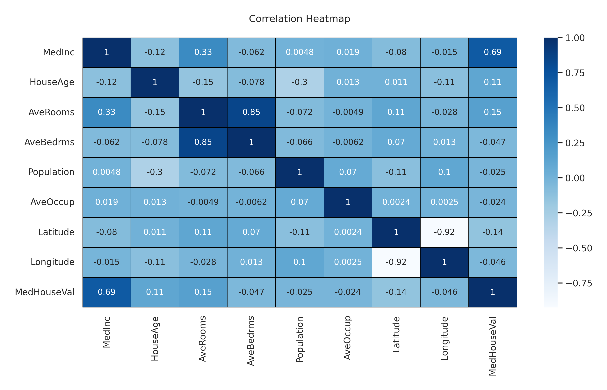
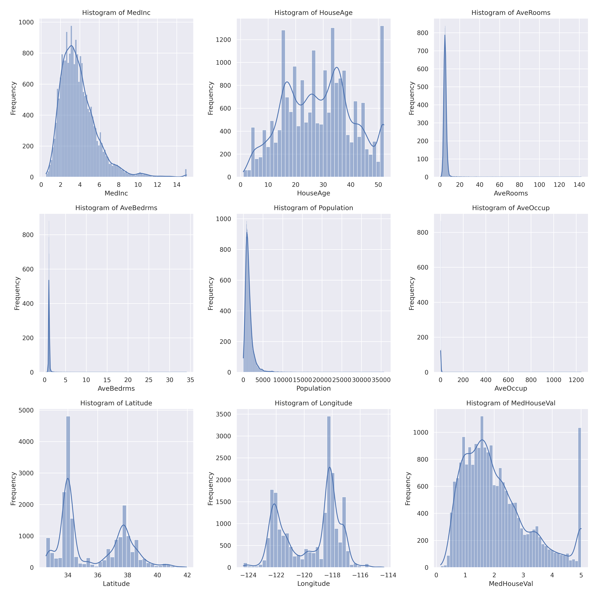
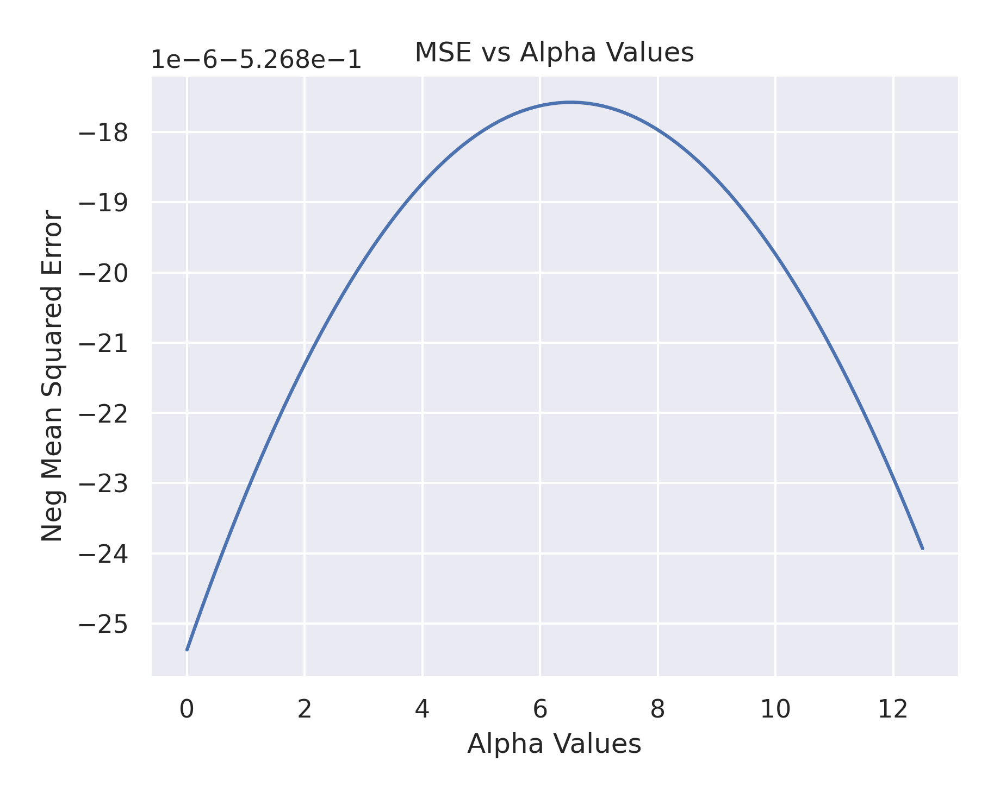

# Regresión del valor de valor medio de casas en distritos de California

## 1. Obtener la correlación entre los atributos y los atributos con el target.

### ¿Cuál atributo tiene mayor correlación lineal con el target?

El atributo con mayor correlación lineal con el target es `MedInc`, correspondiente al ingreso medio en el bloque con un valor de 0.6881.

Se puede entender que a mayor ingreso medio en el bloque, mayor valor medio de las casas.

### ¿Cuáles atributos parecen estar más correlacionados entre sí?

Tomando como umbral -0.75 y 0.75, los atributos que se han encontrado son:

-   `AveBedrms` y `AveRooms` con un correlación de 0.8476.
-   `Latitude` y `Longitude` con una correlación de -0.9247

En el caso de `AveBedrms` y `AveRooms` se puede entender que a mayor número de habitaciones, mayor número de dormitorios. En el caso de `Latitude` y `Longitude` se puede entender que a mayor latitud, menor longitud.

Tambien se puede mencionar la correlación entre `AveRooms` y `MedInc` con un valor de 0.3269, lo que indica que a mayor ingreso medio en el bloque, mayor número de habitaciones.

También se presenta el mapa de calor de correlación del conjunto de datos, donde se puede apreciar lo mencionado anteriormente.

## 2. Graficar los histogramas de los diferentes atributos y el target.

### ¿Qué tipo de forma de histograma se observa? ¿Se observa alguna forma de campana que nos indique que los datos pueden provenir de una distribución gaussiana, sin entrar en pruebas de hipótesis?

En la siguiente imagen se muestran los histogramas de los diferentes atributos y el target.

Como se puede ver, el histograma de `MedInc` tiene una forma de campana, aunque se puede apreciar una ligera asimetría hacia la derecha. En el caso de `MedHouseVal` se puede apreciar una forma de campana, aunque igualmente se puede apreciar una ligera asimetría hacia la derecha, en este caso, también se puede apreciar una cola larga hacia la derecha más prominente, donde existe un valor que pareciera ser atípico de la distribución.

En cuanto a los demás histogramas, estos no aparentan tener una forma de campana, por lo que no se puede asumir que los datos provienen de una distribución gaussiana. Esto debido a que presentan múltiples picos (modas) o una asimetría muy marcada. Tomando como ejemplo a `HouseAge`, se puede apreciar unas considerable dispersión en los datos. Por otro lado, `AveRooms`, `AveBedrms` y `Population` muestran una concentración de datos en un rango muy pequeño.

## 3. Calcular la regresión lineal usando todos los atributos. Con el set de entrenamiento, calcular la varianza total del modelo y la que es explicada con el modelo. ¿El modelo está capturando el comportamiento del target?

Se calculó la regresión lineal y se obtuvieron los siguientes resultados:

-   Valor de intersección: `2.0692`
-   Coeficientes por atributo: `[ 8.49221760e-01  1.22119309e-01 -2.99558449e-01  3.48409673e-01 -8.84488134e-04 -4.16980388e-02 -8.93855649e-01 -8.68616688e-01]`

En cuanto a los valores de Varianza Total y Varianza Explicada, se obtuvieron los siguientes resultados:

-   Varianza Total: `1.3398`
-   Varianza Explicada: `0.8163`

Finalmente, para determinar si el modelo está capturando el comportamiento del target, se puede calcular el radio de varianza explicada y varianza total, obteniendo un valor de `0.6093`. Este valor indica que el modelo aún no está capturando el comportamiento del target.

## 4. Calcular las métricas de MSE, MAE y $R^2$ del set de evaluación.

Se calcularon las métricas de MSE, MAE y $R^2$ del set de evaluación, obteniendo los siguientes resultados:

-   MSE: `0.5306`
-   MAE: `0.5272`
-   $R^2$: `0.5958`

## 5. Crear una regresión de Ridge. Usando una validación cruzada de 5-folds y usando como métrica el MSE, calcular el mejor valor de buscando entre [0, 12.5]. Graficar el valor de MSE versus alfa.

Se calculó la regresión de Ridge con una validación cruzada de 5-folds y se obtuvo el mejor valor de $\alpha$ con un valor de `6.5656`. El valor de MSE obtenido fue de `-0.5268`, donde es negativo porque sklearn utiliza `neg_mean_squared_error`.

La gráfica de MSE vs $\alpha$ se muestra a continuación:

El modelo de Ridge obtenido tiene los siguientes coeficientes y valor de intersección:

-   Valor de intersección: `2.0692`
-   Coeficientes por atributo: `[ 8.48762127e-01  1.22700484e-01 -2.97923492e-01  3.46397229e-01 -6.86724320e-04 -4.17264613e-02 -8.88293472e-01 -8.62975110e-01]`

Viendo solo superficialmente los coeficientes, se puede observar que son muy similares a los obtenidos en la regresión lineal.

## 6. Comparar, entre la regresión lineal y la mejor regresión de Ridge, los resultados obtenidos en el set de evaluación. ¿Cuál da mejores resultados (usando MSE y MAE)? Conjeturar por qué el mejor modelo mejora. ¿Qué error puede haberse reducido?

Se obtuvieron los siguientes resultados para la regresión lineal y la mejor regresión de Ridge:

| Metric                    | Linear Regression | Ridge Regression |
| ------------------------- | ----------------- | ---------------- |
| R-squared                 | 0.5958            | 0.5959           |
| Mean Absolute Error (MAE) | 0.5272            | 0.5272           |
| Mean Squared Error (MSE)  | 0.5306            | 0.5304           |

Ambos modelos tienen resultados muy similares, sin embargo, el modelo de Ridge tiene un mejor desempeño en cuanto a MSE, aunque la diferencia es mínima. Esto se puede deber a que el modelo de Ridge penaliza los coeficientes de los atributos, lo que puede ayudar a reducir el error cuadrático medio.